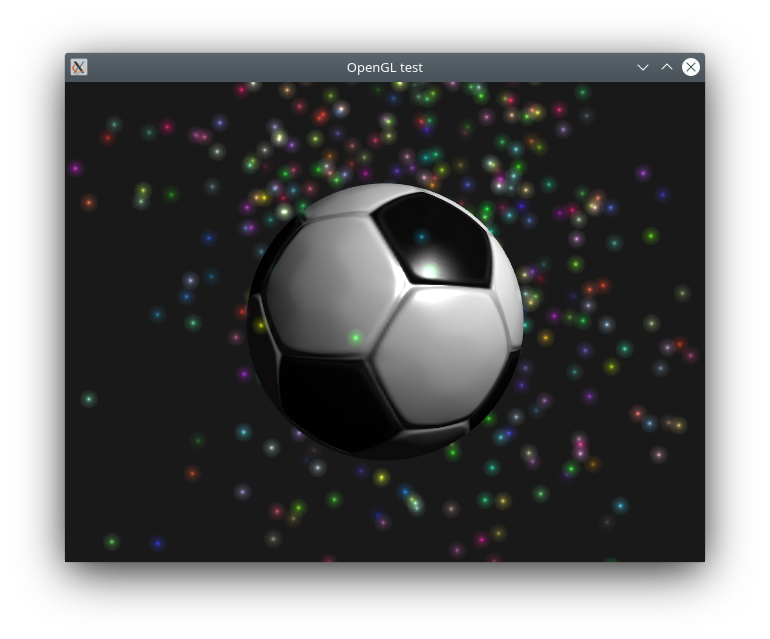

# Starting with OpenGL

## References

Developed following: 
[https://github.com/JensDerKrueger/lnc/tree/master/cpp/OpenGL](https://github.com/JensDerKrueger/lnc/tree/master/cpp/OpenGL)

and using some tutorials and the red book.

Sample textures including normal map from
[https://katfetisov.wordpress.com/category/freebies/](https://katfetisov.wordpress.com/category/freebies/)

## Features
Shows a rotating sphere with texture and normal map. Additional particles are drawn around the sphere.

## Build

### Download textures
e.g. using the script in the folder assets which downloads from [https://katfetisov.wordpress.com/category/freebies/](https://katfetisov.wordpress.com/category/freebies/)

### Using cmake
mkdir build && cd build
cmake ..
make